<div align="center">


[+and+call+it+a+day.;Systems+that+stay+correct+when+everything+breaks.)](https://git.io/typing-svg)

<a href="https://www.iitrpr.ac.in/"></a>
<a href="https://github.com/Aryan-sagar"></a>
<a href="https://github.com/Aryan-sagar"></a>
<a href="https://github.com/Aryan-sagar"></a>

</div>

---

## `> BOOT_SEQUENCE`

```text
INITIALIZING ARYAN.SAGAR...

[████████████████████████████████] 100%

IDENTITY        → SYSTEMS / ML / DATA
ENVIRONMENT     → DISTRIBUTED SYSTEMS / STREAMING
PRIMARY WEAPON  → PYTHON / C++ / SQL / FLINK
CURRENT MODE    → BUILD
STATUS          → ONLINE

MISSION:
    Build software that stays correct
    when reality stops cooperating.

    • retries & race conditions
    • duplicate requests & bad data
    • network failures & concurrent writes
    • distribution shift & partial outages
    • exactly-once semantics & backpressure
    • out-of-order events & late data

SYSTEM READY.
```

---

## `01` — THE MAP

<p align="center">
  
</p>

---

## `02` — BOSS FIGHTS DEFEATED

<a href="https://github.com/Aryan-sagar/Transaction-Data-Warehouse-ELT-Pipeline"></a>
<a href="https://github.com/Aryan-sagar/Idempotent-Payments-Ledger-Reconciliation-Backend"></a>
<a href="https://github.com/Aryan-sagar/-Real-Time-Risk-Fraud-Scoring-Engine"></a>
<a href="https://github.com/Aryan-sagar/-Limit-Order-Book-Matching-Engine-Backtester"></a>
<a href="https://github.com/Aryan-sagar"></a>

---

## `03` — CURRENT MISSION

<a href="https://github.com/Aryan-sagar"></a>

---

## `04` — SIDE QUESTS


---

## `05` — SKILL TREE

<p align="center">
  
</p>

<p align="center"><sub>Bars represent current working depth, not a claim of mastery.</sub></p>

---

## `06` — TECH ARSENAL

<p align="center">
  
</p>

---

## `07` — THE RULES

I optimize for a few things.

```text
┌────────────────────────────────────────────┐
│                                            │
│                CORRECTNESS                 │
│                     ▲                      │
│                     │                      │
│         RELIABILITY ┼ PERFORMANCE          │
│                     │                      │
│                     ▼                      │
│               OBSERVABILITY                │
│                                            │
└────────────────────────────────────────────┘
```

1. **Correctness before cleverness:** A system that produces the wrong answer faster is still wrong.
2. **Failure is a feature:** Retries, duplicate messages, race conditions, partial failures, and corrupted assumptions aren't edge cases. They're the system.
3. **Measure it:** If performance matters: **benchmark it.** If reliability matters: **test it.** If a model matters: **evaluate it.**
4. **Understand the abstraction:** I like frameworks. I like them much less when I don't understand what they're hiding.

---

## `08` — CURRENTLY LEARNING

```text
                ┌─────────────────┐
                │   GO DEEPER     │
                └────────┬────────┘
                         │
        ┌────────────────┼────────────────┐
        ▼                ▼                ▼
   DISTRIBUTED       ML SYSTEMS       STORAGE
    SYSTEMS
        │                │                │
   • Consensus      • Transformers   • WAL / LSM
   • Replication    • Serving        • Compaction
   • Fault Tol.     • Evaluation     • Indexing
   • Failure Rec.   • Monitoring     • Recovery
   • Exactly-once   • Feature store  • Lakehouse
```

---

## `09` — THE NUMBERS

<p align="center">
  
</p>

<p align="center">
  
  
  
</p>

---

## `10` — ACHIEVEMENT LOG

<p align="center">
  
</p>

---

## `11` — OUTSIDE THE TERMINAL

When I'm not thinking about distributed state, race conditions, or financial ledgers:

🎬 Filmmaking · 📷 Photography · 🎞️ Cinematography · 🎸 Guitar · 📚 Psychology, philosophy & history

> *Because engineering and filmmaking share one annoying truth:*
> **The details matter.**

---

## `12` — CONNECT

<div align="center">

### Want to talk systems, ML, data, markets, or just build something ridiculous?

**[LinkedIn](http://www.linkedin.com/in/aryan-sagar-755947254)** · **[GitHub](https://github.com/Aryan-sagar)** · **[Email](mailto:aryansagar.workspace@gmail.com)**

</div>

---

<div align="center">

```text
BUILD → BREAK → MEASURE → UNDERSTAND → REBUILD

                         ↓

              MAKE IT SURVIVE REALITY.
```

### `SYSTEM STATUS: BUILDING`

</div>


