[+and+call+it+a+day.;Systems+that+stay+correct+when+everything+breaks.)](https://git.io/typing-svg)

---

## `> BOOT_SEQUENCE`

  

---

## `01` — THE MAP

  

---

## `02` — BOSS FIGHTS DEFEATED

---

## `03` — CURRENT MISSION

---

## `04` — SIDE QUESTS

---

## `05` — SKILL TREE

  

Bars represent current working depth, not a claim of mastery.

---

## `06` — TECH ARSENAL

  

---

## `07` — THE RULES

  

---

## `08` — CURRENTLY LEARNING

  

---

## `11` — THE DIRECTOR'S CUT

  

---

## `12` — CONNECT

### Want to talk systems, ML, data, markets, or just build something ridiculous?

  

